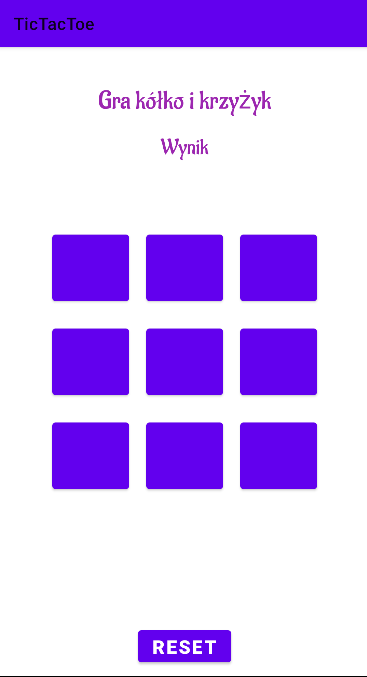
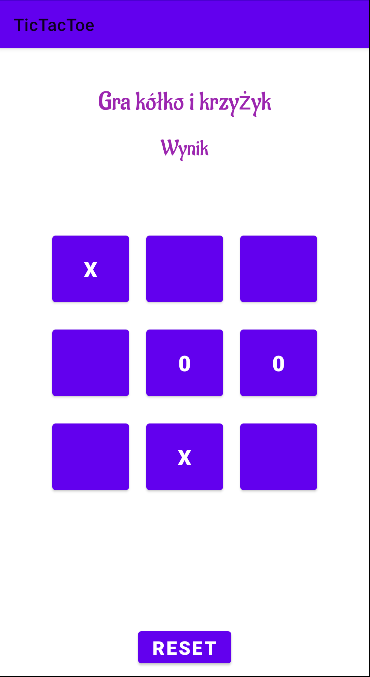
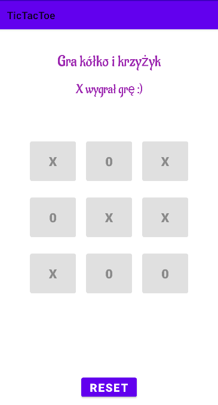

# TicTacToe
A tic tac toe game created with Android studio using kotlin as the main language for the project.
The game allows two players to play, the first player automatically receives "X". 
The winning result is saved from the previous round and is automatically canceled when a new game is played.

